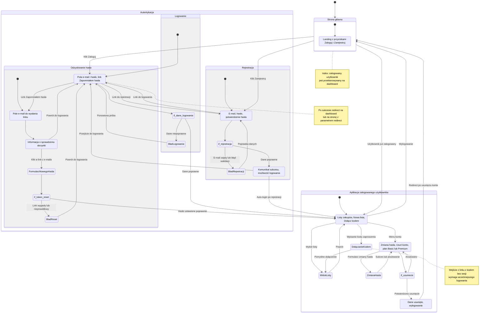

# Diagram podróży użytkownika – moduł autentykacji SmartShopping

<user_journey_analysis>

## 1. Ścieżki użytkownika (PRD + auth-spec)

- **Wejście na stronę główną:** niezalogowany → landing z przyciskami Zaloguj / Zarejestruj; zalogowany → przekierowanie na dashboard.
- **Rejestracja:** formularz e-mail + hasło → walidacja → sukces (komunikat, ewentualnie auto-login) lub błąd (e-mail zajęty, błędy walidacji).
- **Logowanie:** formularz e-mail + hasło → poprawne dane → dashboard lub strona z parametrem redirect; błędne dane → komunikat.
- **Odzyskiwanie hasła:** strona „Zapomniałem hasła” → podanie e-maila → komunikat „Sprawdź e-mail” → klik w link → strona ustawiania nowego hasła → sukces (redirect na login/dashboard) lub błąd (link wygasły).
- **Dostęp do chronionych stron:** wejście na dashboard, listę, ustawienia bez sesji → redirect na logowanie z zapisaniem redirect.
- **Logowanie z redirect:** po poprawnym logowaniu powrót na żądaną stronę (np. dołączenie do listy kodem).
- **Dołączanie do listy kodem:** link z kodem → niezalogowany → redirect na login z redirect do join; po logowaniu dołączenie do listy.
- **Zmiana hasła (zalogowany):** ustawienia konta → formularz (aktualne + nowe hasło) → sukces lub błąd.
- **Usunięcie konta:** ustawienia → akcja Usuń konto → modal potwierdzenia → potwierdzenie → usunięcie danych, wylogowanie, redirect.
- **Wylogowanie:** przycisk Wyloguj → wylogowanie → redirect na stronę główną lub login.

## 2. Główne podróże i stany

| Podróż                             | Stany                                                                                                    |
| ---------------------------------- | -------------------------------------------------------------------------------------------------------- |
| Gość na stronie głównej            | StronaGlowna (landing)                                                                                   |
| Rejestracja                        | FormularzRejestracji → Walidacja → SukcesRejestracji / BladRejestracji                                   |
| Logowanie                          | FormularzLogowania → WeryfikacjaDanych → Dashboard / BladLogowania                                       |
| Odzyskiwanie hasła                 | ZapomnianeHaslo → WyslanieLinku → KomunikatSprawdzEmail → FormularzNowegoHasla → SukcesReset / BladReset |
| Zalogowany – główna funkcjonalność | Dashboard, WidokListy, DołączanieKodem                                                                   |
| Zarządzanie kontem                 | UstawieniaKonta, ZmianaHasla, UsuniecieKonta                                                             |
| Wyjście                            | Wylogowanie → StronaGlowna                                                                               |

## 3. Punkty decyzyjne i ścieżki alternatywne

- **Wejście na index:** Czy użytkownik zalogowany? → Tak: Dashboard; Nie: StronaGlowna (landing).
- **Po wypełnieniu formularza logowania:** Czy dane poprawne? → Tak: Dashboard (lub redirect); Nie: BladLogowania, pozostanie na FormularzLogowania.
- **Po wypełnieniu formularza rejestracji:** Czy dane poprawne i e-mail wolny? → Tak: SukcesRejestracji (logowanie lub komunikat); Nie: BladRejestracji.
- **Po kliknięciu w link z e-maila (reset hasła):** Czy token poprawny i ważny? → Tak: FormularzNowegoHasla; Nie: BladReset (link wygasły).
- **W ustawieniach – usunięcie konta:** Czy użytkownik potwierdził? → Tak: UsuniecieKonta → Wylogowanie; Nie: pozostanie w UstawieniaKonta.

## 4. Cel stanów (krótko)

- **StronaGlowna:** Prezentacja aplikacji dla gościa; linki do logowania i rejestracji.
- **FormularzLogowania:** Wprowadzenie e-maila i hasła w celu zalogowania.
- **FormularzRejestracji:** Wprowadzenie e-maila i hasła w celu utworzenia konta.
- **ZapomnianeHaslo:** Wprowadzenie e-maila w celu otrzymania linku do resetu hasła.
- **KomunikatSprawdzEmail:** Informacja o wysłaniu linku (bez ujawniania, czy konto istnieje).
- **FormularzNowegoHasla:** Ustawienie nowego hasła po kliknięciu w link z e-maila.
- **Dashboard:** Główny widok zalogowanego użytkownika – listy zakupów.
- **UstawieniaKonta:** Zmiana hasła, usunięcie konta, informacje o planie.
- **Wylogowanie:** Zakończenie sesji i powrót do kontekstu gościa.

</user_journey_analysis>

---

<mermaid_diagram>

</mermaid_diagram>
